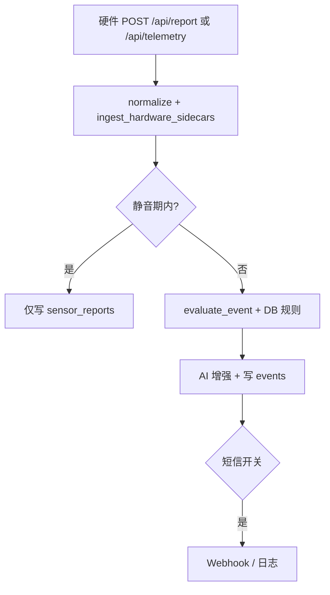
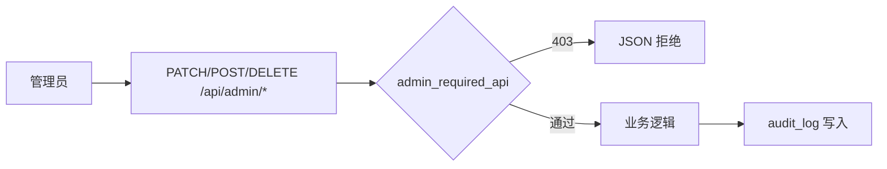

# 核心管理模块设计文档

## 1. 模块说明

| 模块 | 路由 | 功能摘要 |
|------|------|----------|
| 设备管理 | `/admin/devices` | 设备列表 CRUD、在线率饼图、区域在线占比条形图、健康度仪表盘、远程配置（config_json）、指令下发（`diagnostics.pending_command`） |
| 用户与权限 | `/admin/users` | 多角色账号 CRUD、`allowed_modules` / `allowed_zones` JSON 白名单（预留与路由扩展对接） |
| 告警规则 | `/admin/alerts` | `alert_rules` 阈值维护、静音规则 `alert_mutes`、近 7 日事件类型趋势图 |
| 审计 | `/admin/audit` | `audit_logs` 操作留痕、`login_logs` 登录成功/失败 |

硬件数据入口：

- `POST /api/report`：行为打分 + `extra` 环境/门禁/链路（与原有 STM32 JSON 兼容）。
- `POST /api/telemetry`：仅遥测与心跳，无事件判定。

## 2. 流程图

### 2.1 硬件上报与静音

### 2.2 管理员操作审计

## 3. 权限说明

| 角色 | 业务页面 | 管理 API / 管理页 |
|------|----------|-------------------|
| admin | 全部 | 全部 `/api/admin/*` 与 `/admin/*` |
| teacher / student | 全部现有业务页 | **禁止**；访问 `/admin/*` 重定向首页；API 返回 403 |

说明：`allowed_modules`、`allowed_zones` 已持久化并在登录会话中可用，可在后续版本通过 `before_request` 与 `request.endpoint` 做细粒度拦截（当前以角色 + 管理端隔离为主，满足大赛演示与可扩展性）。

## 4. 数据库表（增量）

- `devices`：设备档案、在线状态、`config_json`、`diagnostics_json`（含 `pending_command`）。
- `audit_logs`、`login_logs`：审计与登录。
- `alert_rules`：指标阈值与通知开关占位。
- `alert_mutes`：按设备 ID 或地点子串临时屏蔽告警事件生成。
- `sensor_env_samples`、`door_events`、`device_link_stats`：环境、门禁、链路可视化数据源。

迁移在 `init_db` → `_migrate_schema` 中自动执行，兼容已有 `data/campus_safety.db`。
